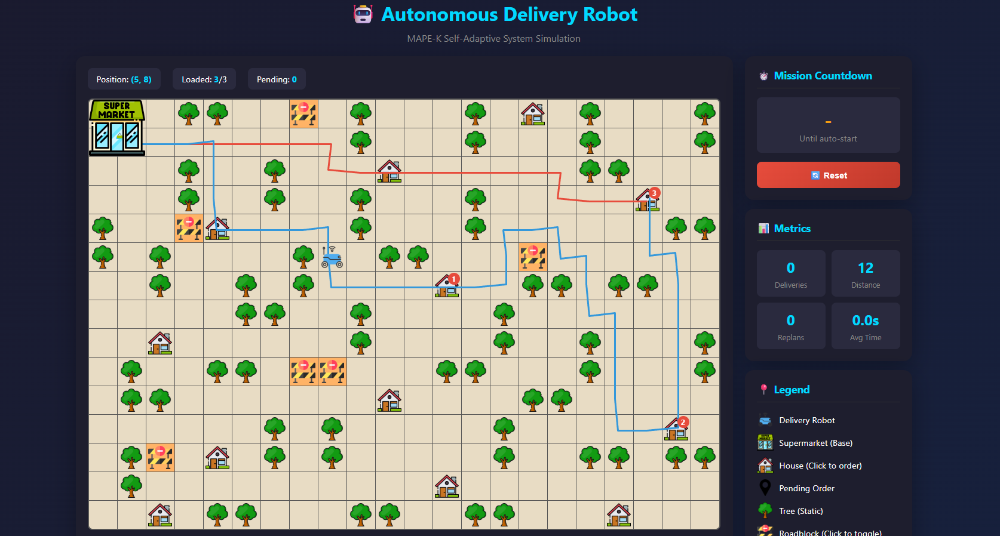

# Autonomous Delivery Robot 🤖

A self-adaptive autonomous delivery robot simulation implementing the **MAPE-K (Monitor, Analyze, Plan, Execute, Knowledge)** architecture as a microservices system with MQTT-based communication.




## 📋 Table of Contents

- [Overview](#-overview)
- [Features](#-features)
- [Architecture](#-architecture)
- [Project Structure](#-project-structure)
- [Installation](#-installation)
- [Usage](#-usage)
- [MAPE-K Components](#-mape-k-components)
- [MQTT Topics](#-mqtt-topics)
- [Metrics & Config](#-metrics)
- [Contributors](#-developed-by)

## 🎯 Overview

This project simulates an autonomous delivery robot operating in a 2D grid environment (22x15). The robot picks up orders from a supermarket and delivers them to houses while adapting to dynamic obstacles in real-time.

The system demonstrates key concepts of **self-adaptive systems**:
- Real-time monitoring of the environment
- Analysis of situations requiring adaptation
- Dynamic path planning using A* algorithm
- Execution of movement and delivery actions
- Knowledge base maintaining system state

**Key architectural feature**: Each MAPE-K component runs as an independent Docker container, communicating exclusively via MQTT publish/subscribe messaging. This enables **runtime replacement** of any component without affecting others.

## ✨ Features

- **Autonomous Navigation**: A* pathfinding with optimal delivery sequence (tries all permutations for ≤5 deliveries)
- **Dynamic Adaptation**: Real-time replanning when obstacles appear/disappear
- **Interactive Environment**: Click to add orders or place/remove roadblocks
- **Visual Feedback**: 
  - Delivery order numbers (1, 2, 3) showing priority
  - Pending order indicators
  - Path visualization with color coding:
    - **Blue line**: Delivery path (Base → Houses)
    - **Red line**: Return path (Last house → Base)
  - Stuck state detection
- **Mission Management**:
  - Auto-start after 3 orders OR 30-second timeout
  - Capacity-based loading (max 3 orders)
- **Metrics Tracking**: Distance traveled, deliveries completed, replans count, average delivery time
- **Microservices Architecture**: Each MAPE-K component is independently deployable and replaceable at runtime

## 🏗️ Architecture

The system uses a **centralized MAPE-K loop** with **MQTT-based microservices**:

```
┌─────────────────────────────────────────────────────────────────────┐
│                        MQTT Broker (Mosquitto)                      │
│                                                                     │
│    mape/monitor/result    mape/analyze/result    mape/plan/result   │
│           │                      │                      │           │
│           ▼                      ▼                      ▼           │
│  ┌──────────┐  ────────► ┌──────────┐ ────────► ┌──────────┐        │
│  │ Monitor  │            │ Analyze  │           │   Plan   │        │
│  │ Service  │            │ Service  │           │ Service  │        │
│  └──────────┘            └──────────┘           └──────────┘        │
│       │                                               │             │
│       │ subscribes to                                 │             │
│       │ knowledge/update                              ▼             │
│       │ environment/update              ┌──────────────────┐        │
│       │                                 │ Execute Service  │        │
│       ▼                                 └────────┬─────────┘        │
│  ┌──────────────────┐                            │                  │
│  │ Knowledge Service │◄───── knowledge/set ──────┘                  │
│  └──────────────────┘                            │                  │
│       │                                          │                  │
│       │ knowledge/update                         │ environment/*    │
│       ▼                                          ▼                  │
│  ┌──────────────────────────────────────────────────────────────┐   │
│  │                    Environment Service                       │   │
│  │                     (Grid + Robot)                           │   │
│  └──────────────────────────────────────────────────────────────┘   │
│                              │                                      │
│                              │ environment/update                   │
│                              ▼                                      │
│  ┌──────────────────────────────────────────────────────────────┐   │
│  │                       Web Service                            │   │
│  │                  (UI + Loop Trigger)                         │   │
│  └──────────────────────────────────────────────────────────────┘   │
└─────────────────────────────────────────────────────────────────────┘
```

### MAPE-K Message Flow

```
Web triggers ──► mape/monitor/request
                        │
                        ▼
              Monitor publishes ──► mape/monitor/result
                                           │
                                           ▼
                                 Analyze publishes ──► mape/analyze/result
                                                              │
                                                              ▼
                                                    Plan publishes ──► mape/plan/result
                                                                              │
                                                                              ▼
                                                                    Execute commands
                                                                    environment & knowledge
```

## 📁 Project Structure

```
autonomous-delivery-robot/
├── assets/                      # Icon images
│   ├── robot.png
│   ├── supermarket.png
│   ├── house.png
│   ├── pending.png
│   ├── tree.png
│   └── roadblock.png
├── services/
│   ├── shared/                  # Shared utilities
│   │   ├── __init__.py
│   │   ├── mqtt_client.py      # MQTT client wrapper
│   │   └── state_models.py     # State data structures
│   ├── knowledge/               # Knowledge service
│   │   ├── Dockerfile
│   │   └── service.py
│   ├── environment/             # Environment service (Grid + Robot)
│   │   ├── Dockerfile
│   │   └── service.py
│   ├── monitor/                 # Monitor service
│   │   ├── Dockerfile
│   │   └── service.py
│   ├── analyze/                 # Analyze service
│   │   ├── Dockerfile
│   │   └── service.py
│   ├── plan/                    # Plan service (A* pathfinding)
│   │   ├── Dockerfile
│   │   └── service.py
│   ├── execute/                 # Execute service
│   │   ├── Dockerfile
│   │   └── service.py
│   └── web/                     # Web service (UI + orchestration)
│       ├── Dockerfile
│       ├── service.py
│       └── templates/
│           └── index.html
├── docker-compose.yml
├── mosquitto.conf               # MQTT broker configuration
└── README.md
```

## 🚀 Installation

### Prerequisites
- Docker
- Docker Compose

### Steps

1. **Clone the repository**
   ```bash
   git clone https://github.com/meteharun/autonomous-delivery-robot.git
   cd autonomous-delivery-robot
   ```

2. **Build and run with Docker Compose**
   ```bash
   docker-compose up --build
   ```

3. **Open in browser**
   ```
   http://localhost:5000
   ```

4. **Stop the containers**
   ```bash
   docker-compose down
   ```

### Runtime Component Replacement

One of the key features of this architecture is **runtime replaceability**. To replace a component:

```bash
# Stop only the plan service
docker-compose stop plan

# Modify services/plan/service.py (e.g., change algorithm)

# Rebuild and restart only the plan service
docker-compose up --build plan
```

The other services continue running and will automatically use the updated Plan service when it reconnects to MQTT.

## 🎮 Usage

### Controls

| Action | How To |
|--------|--------|
| **Add delivery order** | Click on a house (building icon) |
| **Add roadblock** | Click on an empty road cell |
| **Remove roadblock** | Click on an existing roadblock |
| **Reset simulation** | Click the Reset button |

### Mission Rules

- **Capacity**: Robot can carry up to 3 orders at once
- **Auto-start**: Mission begins when:
  - 3 orders are pending, OR
  - 30 seconds have passed since first order
- **Delivery order**: Optimal route algorithm (brute-force for ≤5 orders, nearest-neighbor for more)
- **Replanning**: Robot automatically recalculates path when:
  - A roadblock is added in its path
  - A roadblock is removed (may find shorter path)

### Visual Indicators

| Symbol | Meaning |
|--------|---------|
| 🤖 Robot icon | Current robot position |
| 🏪 Supermarket (2x2) | Base station - robot starts/returns here |
| 🏠 House | Delivery location |
| 📦 Pending icon | Order waiting to be picked up |
| 1️⃣ 2️⃣ 3️⃣ Numbers | Delivery sequence order |
| 🌳 Tree | Static obstacle (cannot be removed) |
| 🚧 Roadblock | Dynamic obstacle (can be toggled) |
| 🔵 Blue line | Delivery path (Base → Houses) |
| 🔴 Red line | Return path (Last house → Base) |
| ⚠️ STUCK | Robot has no valid path |

## 🔧 MAPE-K Components

Each component runs as an independent Docker container:

### Monitor (`services/monitor/service.py`)
- Subscribes to: `knowledge/update`, `environment/update`, `mape/monitor/request`
- Publishes to: `mape/monitor/result`
- Collects sensor data: robot position, obstacles, orders
- Detects path blockages and environmental changes

### Analyze (`services/analyze/service.py`)
- Subscribes to: `mape/monitor/result`
- Publishes to: `mape/analyze/result`
- Evaluates if adaptation is needed
- Detects mission triggers (capacity/timeout)
- Determines replanning requirements

### Plan (`services/plan/service.py`)
- Subscribes to: `mape/analyze/result`
- Publishes to: `mape/plan/result`
- Creates optimal delivery sequences using A* algorithm
- Handles replanning when blocked

### Execute (`services/execute/service.py`)
- Subscribes to: `mape/plan/result`, `knowledge/update`, `environment/update`
- Publishes to: `knowledge/set`, `environment/*` commands
- Issues movement commands
- Handles order loading/delivery

### Knowledge (`services/knowledge/service.py`)
- Subscribes to: `system/init`, `system/reset`, `user/add_order`, `knowledge/set`
- Publishes to: `knowledge/update`
- Stores system state: orders, plan, metrics
- Pure data storage with no logic

### Environment (`services/environment/service.py`)
- Subscribes to: `system/init`, `system/reset`, `user/toggle_obstacle`, `environment/*`
- Publishes to: `environment/update`
- Manages Grid and Robot state

## 📡 MQTT Topics

| Topic | Publisher | Subscribers | Purpose |
|-------|-----------|-------------|---------|
| `system/init` | Web | Knowledge, Environment | Initialize system |
| `system/reset` | Web | All services | Reset simulation |
| `user/add_order` | Web | Knowledge | Add delivery order |
| `user/toggle_obstacle` | Web | Environment | Add/remove roadblock |
| `mape/monitor/request` | Web | Monitor | Trigger monitoring cycle |
| `mape/monitor/result` | Monitor | Analyze | Sensor data & conditions |
| `mape/analyze/result` | Analyze | Plan | Adaptation decision |
| `mape/plan/result` | Plan | Execute | Action with path/sequence |
| `knowledge/update` | Knowledge | Monitor, Execute, Web | Current system state |
| `knowledge/set` | Execute | Knowledge | Update state fields |
| `environment/update` | Environment | Monitor, Execute, Web | Grid and robot state |
| `environment/move_robot` | Execute | Environment | Move command |
| `environment/load_order` | Execute | Environment | Load order command |
| `environment/deliver_order` | Execute | Environment | Deliver command |

## 📊 Metrics

The system tracks:
- **Total Deliveries**: Number of completed deliveries
- **Total Distance**: Cells traveled by the robot
- **Replans**: Number of path recalculations
- **Average Delivery Time**: Mean time per delivery

## 🛠️ Configuration

Key parameters in the code:

| Parameter | Location | Default | Description |
|-----------|----------|---------|-------------|
| Grid size | `state_models.py` | 22x15 | Map dimensions |
| Max capacity | `state_models.py` | 3 | Orders per mission |
| Mission timeout | `state_models.py` | 30s | Auto-start timer |
| Robot speed | `web/service.py` | 0.4s | MAPE-K loop interval |

## 👥 Developed by

- [Mete Harun Akcay](https://github.com/meteharun)
- [Thanh Phuc Tran](https://github.com/phuc-tr)
- [Pragati Manandhar](https://github.com/mdhrpragati)

## 🙏 Acknowledgements

This project was developed for the **Software Engineering for Autonomous Systems (SE4AS)** course, University of L'Aquila, Fall Semester 2025–2026.